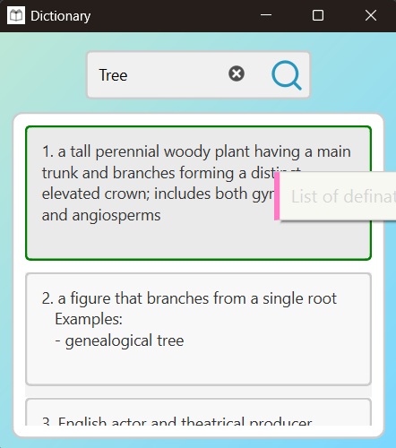

# Dictionary Project



This project is a GUI-based Dictionary application built using Python, PySide6, and NLTK. It allows users to search for
definitions, synonyms, antonyms, and other lexical information about words.

## 📸 Preview

<!-- Replace the path or URL below with your actual image path if needed -->
<p align="center">
  
  
</p>

## Features

- Search for word definitions
- Retrieve synonyms and antonyms
- Simple and user-friendly GUI
- Built using PySide6 for the interface
- Utilizes NLTK for natural language processing

## 🧠 Project Structure

```plaintext
Dictionary/
├── prj_img/
│   ├── dictionary.png
│   └── version/
│       └── #images
├── resources/
│   ├── icons/
│   │   ├── app_icon.ico
│   │   └── search_icon.svg
│   └── styles/
│       └── stylesheet.qss
├── src/
│   ├── __init__.py
│   ├── utils/
│   │   ├── __init__.py
│   │   ├── meta.py
│   ├── app_logic/
│   │   ├── __init__.py
│   │   ├── log.py
│   │   ├── app_config.py
│   │   ├── dictionary.py
│   │   └── update_manager.py
│   ├── app_services/
│   │   ├── __init__.py
│   │   └── github_service.py
│   └── app_ui/
│       ├── __init__.py
│       ├── main_window.py
│       ├── ui_main_window.py
│       └── ui_update_window.py
├── main.py
├── Jenkinsfile
├── requirements.txt
├── latest_version.md
├── README.md
└── LICENSE
```

## Installation

To install the necessary dependencies, run the following command:

```bash
pip install -r requirements.txt
```

```bash
git clone https://github.com/pyapril15/Dictionary.git
cd Dictionary
```

## Run Application

```bash
python main.py
```

## License

This project is licensed under the MIT License - see the LICENSE file for details.

## Author

- Praveen Yadav - pyapril15
- Email: praveen885127@gmail.com
- 